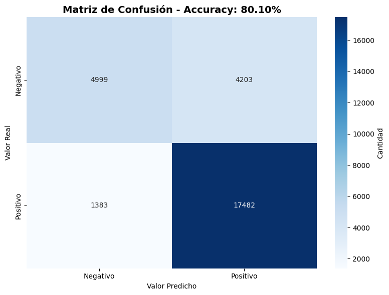
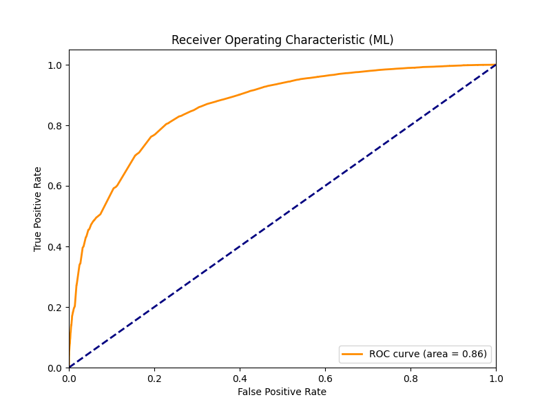
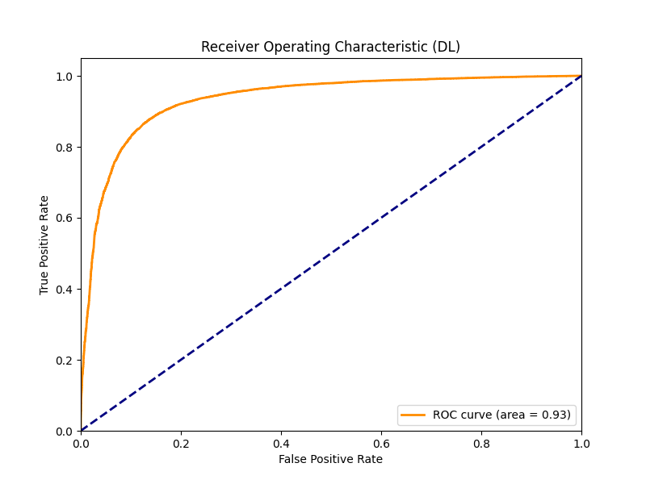

# 🍔 McDonald's Review Sentiment Analysis


## 📌 Project Overview

This project aims to analyze and classify customer reviews of McDonald's restaurants in Barcelona. By leveraging both **Machine Learning (Logistic Regression)** and **Deep Learning (Neural Networks)** techniques, the system predicts whether a review is **positive** or **negative** based on its textual content.

The project explores two distinct approaches:
1.  **Lexicon-based Feature Engineering**: Using a custom sentiment dictionary to count positive, negative, and neutral words.
2.  **TF-IDF Vectorization**: Converting text into numerical vectors for a Deep Learning model.

---

## 🚀 Key Features

*   **Data Cleaning & Preprocessing**: Automated cleaning and translation of review text.
*   **Custom Sentiment Dictionary**: Integration of a domain-specific dictionary (`dictionary/custom_dictionary.csv`) to enhance sentiment detection.
*   **Machine Learning Model**: Logistic Regression classifier based on sentiment word counts.
*   **Deep Learning Model**: Sequential Neural Network trained on TF-IDF features.
*   **Comprehensive Evaluation**: Performance metrics including Accuracy, Confusion Matrix, and ROC Curves.

---

## 📂 Project Structure

```bash
reviews_classificator/
│
├── data/                   # Dataset folder (e.g., clean_dataset.csv)
├── dictionary/             # Custom sentiment dictionary
│   └── custom_dictionary.csv
├── models/                 # Saved models (e.g., sentiment_nn_model.keras)
├── notebooks/              # Exploratory Data Analysis (EDA) notebooks
├── results/                # Generated plots and evaluation metrics
│   ├── dl_roc_curve.png
│   ├── ml_confusion_matrix.png
│   └── ml_roc_curve.png
├── utils/                  # Utility scripts for cleaning and classification
│   ├── clean.py
│   └── classifier.py
├── main.ipynb              # Main script for Machine Learning model
├── neuronal.ipynb          # Main script for Deep Learning model
├── requirements.txt        # Project dependencies
└── README.md               # Project documentation
```

---

## 🛠️ Installation

1.  **Clone the repository**:
    ```bash
    git clone https://github.com/xaviifar/mcdonalds-review-sentiment-analysis.git
    cd mcdonalds-review-sentiment-analysis
    ```

2.  **Create a virtual environment** (recommended):
    ```bash
    python -m venv .venv
    source .venv/bin/activate  # On Windows: .venv\Scripts\activate
    ```

3.  **Install dependencies**:
    ```bash
    pip install -r requirements.txt
    ```

---

## 💻 Usage

### Machine Learning Approach
Open and run `main.ipynb` to train and evaluate the **Logistic Regression** model. This notebook uses the custom dictionary to engineer features based on word polarity counts.

### Deep Learning Approach
Open and run `neuronal.ipynb` to train and evaluate the **Neural Network** model. This notebook uses TF-IDF vectorization to capture semantic meaning from the reviews.

---

## 📊 Methodology

### 1. Data Preprocessing
*   **Cleaning**: Removal of special characters, stopwords, and lowercasing.
*   **Translation**: Reviews are translated to English (if not already) to utilize standard NLP libraries effectively.

### 2. Feature Engineering
*   **Approach A (ML)**: Counting the occurrence of positive, negative, and neutral words using `dictionary/custom_dictionary.csv`.
*   **Approach B (DL)**: Term Frequency-Inverse Document Frequency (TF-IDF) with `max_features=5000`.

### 3. Model Architecture
*   **Neural Network**:
    *   Input Layer: 5000 features (TF-IDF)
    *   Hidden Layers: Dense layers with ReLU activation and Dropout for regularization.
    *   Output Layer: Sigmoid activation for binary classification.
    *   Optimizer: Adam
    *   Loss Function: Binary Crossentropy

---

## 📈 Results

### Machine Learning (Logistic Regression)
The Machine Learning model provides a solid baseline using interpretable features (word counts).

#### Confusion Matrix


#### ROC Curve


### Deep Learning (Neural Network)
The Deep Learning model leverages the full textual context via TF-IDF, achieving competitive performance.

#### ROC Curve (Deep Learning)


---

## 🧰 Technologies Used

*   **Python**: Primary programming language.
*   **Pandas & NumPy**: Data manipulation and numerical operations.
*   **Scikit-Learn**: Machine Learning algorithms and evaluation metrics.
*   **TensorFlow/Keras**: Deep Learning model construction and training.
*   **NLTK**: Natural Language Processing utilities (tokenization).
*   **Matplotlib & Seaborn**: Data visualization and plotting.

---

Made with ❤️ by [Xaviifar](https://github.com/xaviifar)
